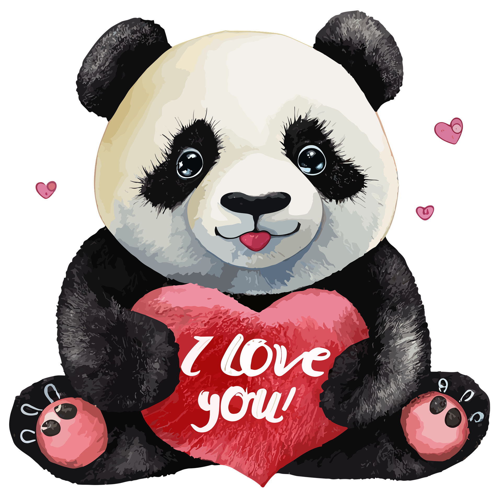

# Catch My Love Game - Backup

This file contains the HTML and JavaScript for the "Catch My Love" mini-game, backed up on 2026-02-06 as requested.

## HTML
```html
        <!-- Screen 2.5: Catch My Love Game -->
        <section id="game-screen" class="screen hidden">
            <div class="sticker-wrapper">
                <div class="sticker-circle">
                    
                </div>
            </div>
            <h2 class="step-title">Catch My Love! ❤️</h2>
            <div id="game-area">
                <!-- Hearts will spawn here -->
            </div>
            <div class="progress-bar-container">
                <div id="game-progress" class="progress-bar"></div>
            </div>
        </section>
```

## CSS
```css
/* Catch My Love / Game Area */
#game-area {
    width: 100%;
    height: 300px;
    background: rgba(255, 255, 255, 0.05);
    border: 1px dashed rgba(255, 255, 255, 0.2);
    border-radius: 20px;
    position: relative;
    overflow: hidden;
    margin-bottom: 20px;
}

.game-heart {
    position: absolute;
    font-size: 2.5rem;
    cursor: pointer;
    user-select: none;
    z-index: 100;
}

.progress-bar-container {
    width: 100%;
    height: 15px;
    background: rgba(255, 255, 255, 0.1);
    border-radius: 10px;
    overflow: hidden;
}

.progress-bar {
    width: 0%;
    height: 100%;
    background: var(--primary);
    transition: width 0.3s ease;
}
```

## JavaScript
```javascript
    // 2.5 Catch My Love Game
    function startGame() {
        const gameArea = document.getElementById('game-area');
        const progress = document.getElementById('game-progress');
        let caughtCount = 0;
        const target = 10;

        function spawnHeart() {
            if (caughtCount >= target) return;

            const heart = document.createElement('div');
            heart.classList.add('game-heart');
            heart.innerHTML = '❤️';
            heart.style.left = Math.random() * (gameArea.offsetWidth - 40) + 'px';
            heart.style.top = '-50px'; // Spawn from top
            gameArea.appendChild(heart);

            gsap.to(heart, {
                y: gameArea.offsetHeight + 50,
                x: '+=' + (Math.random() - 0.5) * 100,
                rotation: Math.random() * 360,
                duration: Math.random() * 2 + 1.5,
                ease: 'power1.in',
                onComplete: () => {
                    if (heart.parentElement) {
                        heart.remove();
                        spawnHeart(); // Respawn if missed
                    }
                }
            });

            heart.addEventListener('click', () => {
                caughtCount++;
                progress.style.width = (caughtCount / target * 100) + '%';
                showSuccessBurst(heart);
                heart.remove();

                if (caughtCount < target) {
                    spawnHeart();
                } else {
                    setTimeout(() => {
                        gsap.to(document.getElementById('game-screen'), {
                            opacity: 0, duration: 0.5, onComplete: () => {
                                document.getElementById('game-screen').classList.add('hidden');
                                document.getElementById('game-screen').style.opacity = 1;
                                proposalScreen.classList.remove('hidden');
                            }
                        });
                    }, 500);
                }
            });
        }

        // Initial burst
        for (let i = 0; i < 3; i++) setTimeout(spawnHeart, i * 500);
    }
```
